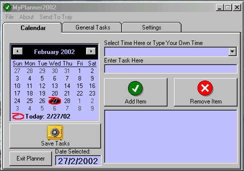

<div align="center">

## MyPlanner2002 \(Final\)


</div>

### Description

This is a simple planner utility with a general tasks option and a calendar. Uses popup menus and now has a few color schemes.

Final release: thanks for all the input and bugs, and sorry for putting this up and taking it down again.
 
### More Info
 
Increased productivity and efficiency


<span>             |<span>
---                |---
**Submitted On**   |2002-02-24 15:14:16
**By**             |[John Stouffer](https://github.com/Planet-Source-Code/PSCIndex/blob/master/ByAuthor/john-stouffer.md)
**Level**          |Intermediate
**User Rating**    |4.3 (30 globes from 7 users)
**Compatibility**  |VB 6\.0
**Category**       |[Complete Applications](https://github.com/Planet-Source-Code/PSCIndex/blob/master/ByCategory/complete-applications__1-27.md)
**World**          |[Visual Basic](https://github.com/Planet-Source-Code/PSCIndex/blob/master/ByWorld/visual-basic.md)
**Archive File**   |[MyPlanner2582002282002\.zip](https://github.com/Planet-Source-Code/john-stouffer-myplanner2002-final__1-32043/archive/master.zip)

### API Declarations

```
Private Declare Sub GetLocalTime Lib "kernel32" (lpSystemTime As SYSTEMTIME)
```


